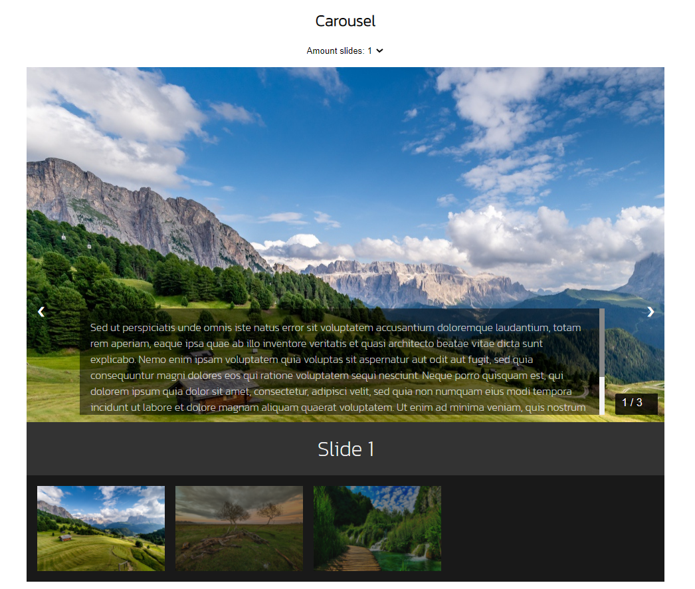

# Carousel

***
+ Screenshot
  

+ Demo: []
***
## Start project

+ To install all dependencies use [`npm install`](https://docs.npmjs.com/cli/install)
  ```bash
  $ npm install
  ```
+ To start server on local host use `npm start`

  ```bash
  $ npm start
  ```
  Runs the app in the development mode.
  Open http://localhost:8080 to view it in the browser.
  
    

